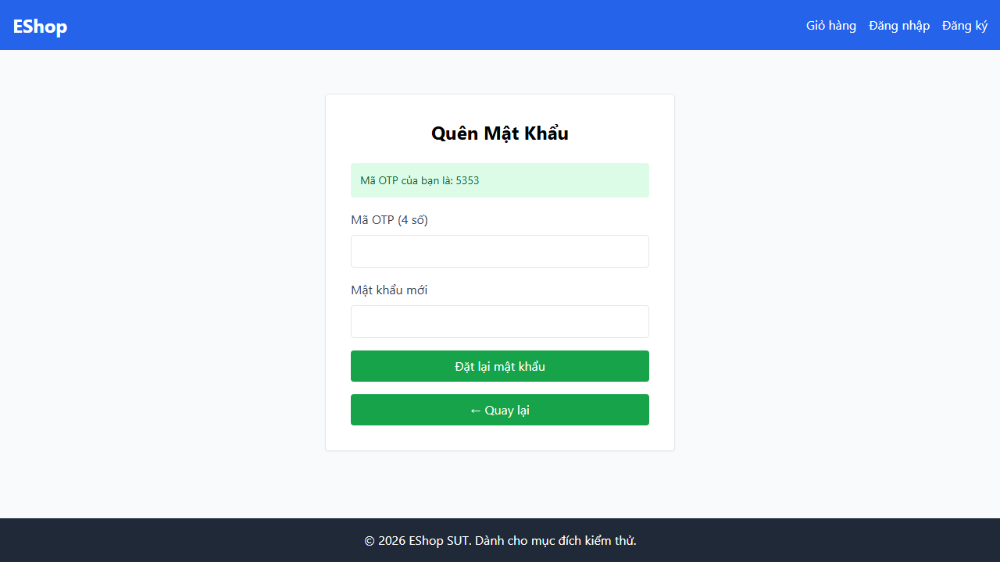
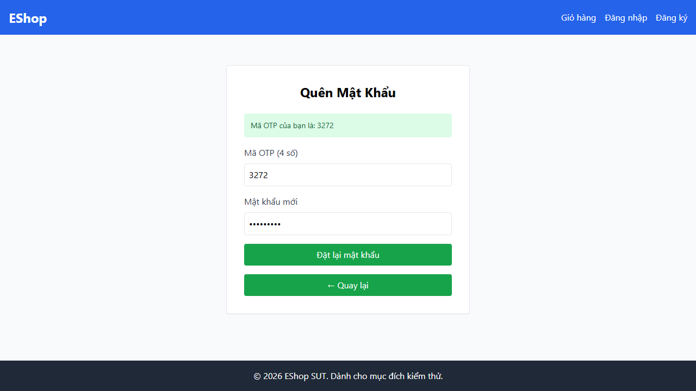
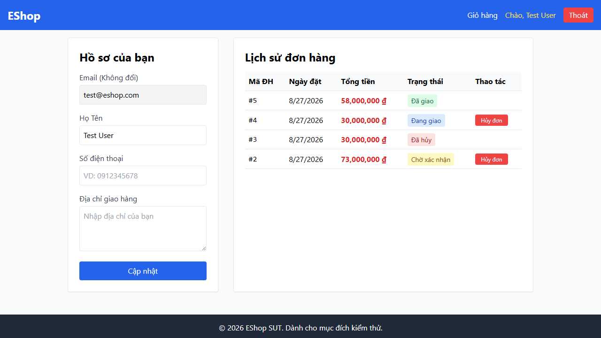
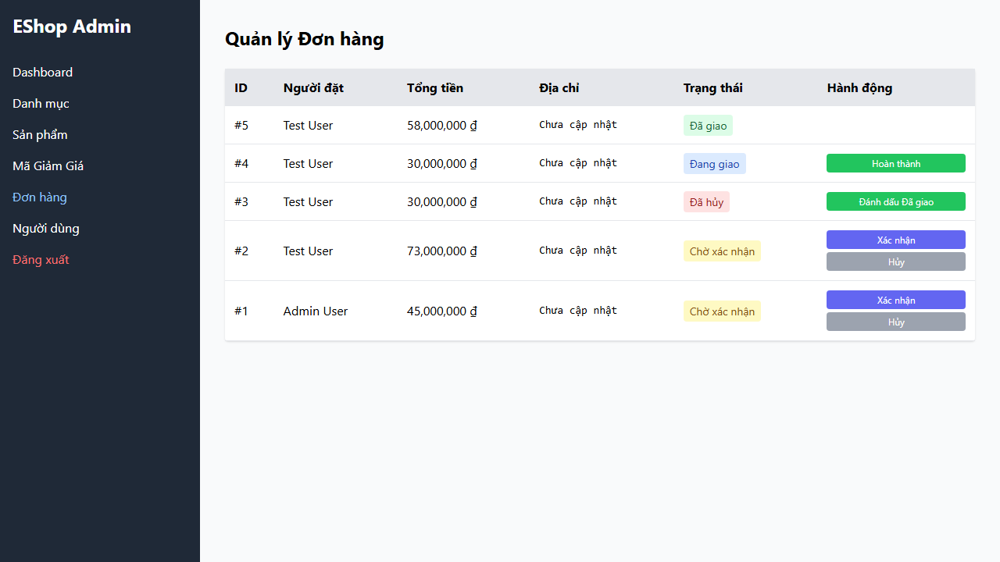
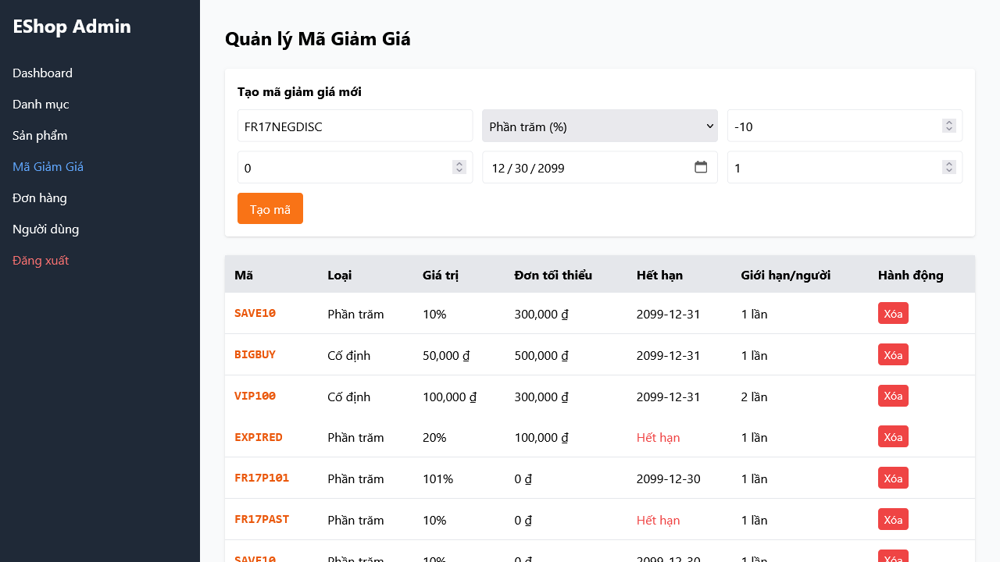
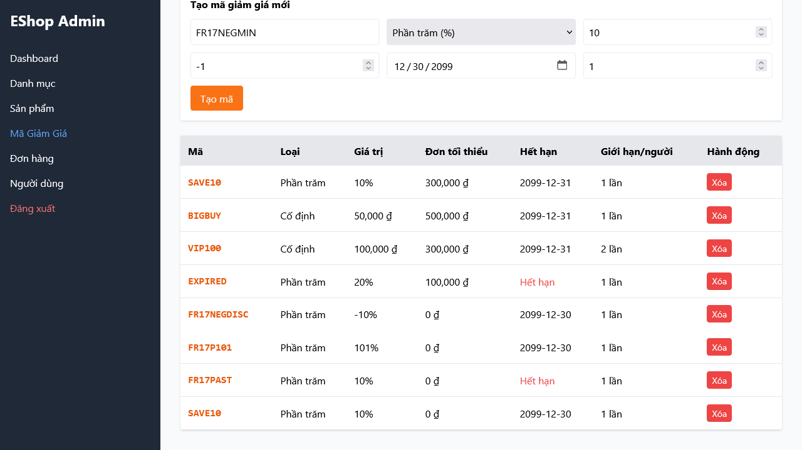
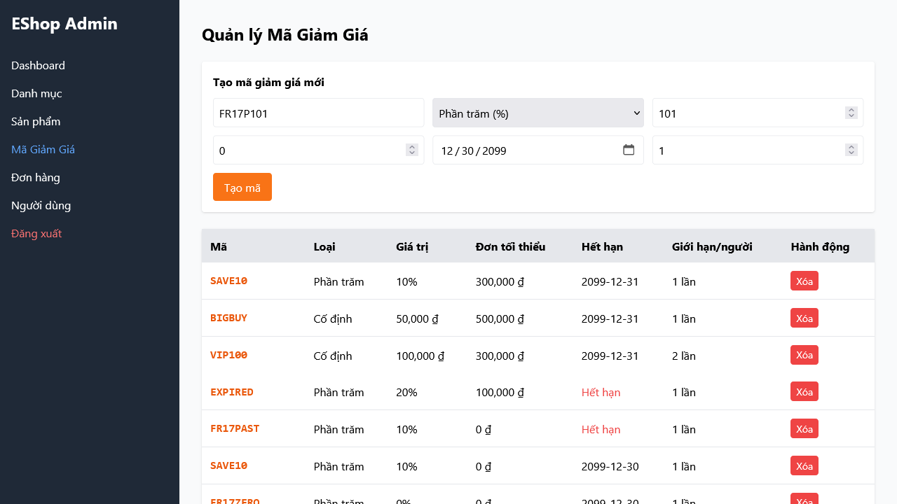
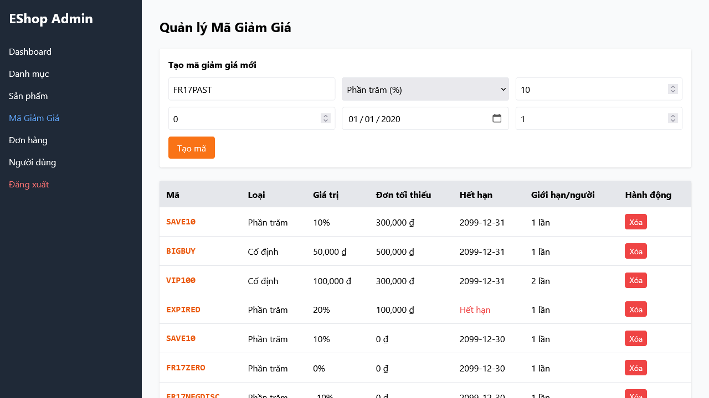
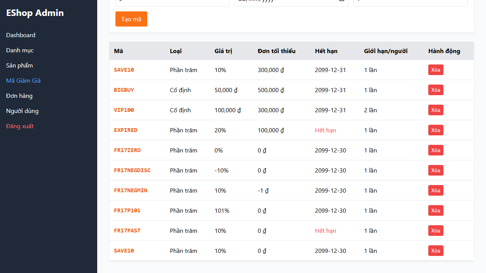

# HW04 – Automation Testing – Main Report

**Họ tên:** Nguyễn Bình Minh Phương   
**MSSV:** 23127104  
**Lớp:** 23KTPM4  
**SUT:** EShop — https://github.com/ttbhanh/eshop-sut   
**GitHub repo bài làm:** https://github.com/nbmp2005/SoftwareTesting-HW04-23127104  

---

## 0. AI Policy Declaration

I use AI tools for the following tasks: requirement analysis, test design, data-driven Playwright generation, script review, documentation scaffolding, and gap analysis. All final scripts, expected results, executions, reports, bug conclusions, and submission artifacts were reviewed by me.

---

## 1. Feature Selection

| Pool | FR | Tên chức năng |
|---|---|---|
| A | FR-03 | Quên mật khẩu & Đặt lại mật khẩu (2 bước) |
| B | FR-11 | Xem lịch sử đơn hàng (User) |
| C | FR-17 | Quản lý Mã Giảm Giá (Coupon CRUD) |

---

## 2. Feature A — FR-03: Quên mật khẩu & Đặt lại mật khẩu

### 2.1. Mô tả chức năng
- **Bước 1 — Lấy mã OTP:** người dùng nhập email đã đăng ký → hệ thống sinh OTP và hiển thị trực tiếp trên màn hình demo.
- **Bước 2 — Đặt lại mật khẩu:** nhập OTP + mật khẩu mới rồi bấm `Đặt lại mật khẩu`. UI hiện tại không có trường xác nhận mật khẩu. Mật khẩu mới phải theo điều kiện FR-01 và OTP chỉ hợp lệ cho đúng email đã yêu cầu.

### 2.2. Quy trình dùng AI (AI-first, từng bước)

| Bước | Việc làm | Công cụ/Skill dùng | Ghi chú |
|---|---|---|---|
| 1 | Khám phá business rule từ source code SUT | `fr-context-explorer` | ... |
| 2 | Sinh danh sách test case (≥12) | `testcase-generator` | ... |
| 3 | Review, chọn/sửa test case | Thủ công | ... |
| 4 | Convert test case → script Playwright | `playwright-script-writer` | ... |
| 5 | Tách dữ liệu test ra file riêng | ... | `data/fr03-reset-password.json` |
| 6 | Cấu hình chạy multi-browser + report | `multibrowser-runner-report` | ... |
| 7 | Review & fix script AI sinh | Thủ công | xem mục 2.5 |

### 2.3. Danh sách Test Case (≥12)

| ID | Loại | Mô tả | Bước thực hiện | Dữ liệu vào | Kết quả mong đợi | Tự động hóa? |
|---|---|---|---|---|---|---|
| TC01 | Positive | Nhập email hợp lệ ở Bước 1 | Vào /forgot-password; Nhập email; Bấm Lấy mã OTP | `admin@eshop.com` | Chuyển sang Bước 2 | ✅ |
| TC02 | Positive | Nhập đúng OTP + mật khẩu mới hợp lệ | Vào Bước 2; Nhập OTP; Nhập mật khẩu mới mạnh; Bấm Đặt lại mật khẩu | OTP đúng, pass: `Abc@12345` | Cập nhật mật khẩu thành công | ✅ |
| TC03 | Positive | Bấm Quay lại đăng nhập | Vào /forgot-password; Bấm Quay lại đăng nhập | - | Chuyển về /login | ✅ |
| TC04 | Positive / BVA | OTP được sinh đúng 6 chữ số | Nhập email hợp lệ; Bấm Lấy mã OTP; Đếm số chữ số của OTP hiển thị | Độ dài mong đợi: `6` | OTP hiển thị gồm đúng 6 chữ số | ✅ |
| TC05 | Negative | Email không được để trống | Để trống email; Bấm Lấy mã OTP | `""` | Lỗi: Email không được để trống | ✅ |
| TC06 | Negative | Email sai định dạng | Nhập "abc"; Bấm Lấy mã OTP | `"abc"` | Vẫn ở Bước 1 và không sinh OTP | ✅ |
| TC07 | Negative | OTP sai | Vào Bước 2; nhập OTP khác OTP thật nhưng cùng độ dài; Bấm Đặt lại mật khẩu | OTP được dẫn xuất động | Vẫn ở Bước 2 và không báo thành công | ✅ |
| TC08 | Negative | Mật khẩu và xác nhận không khớp | Không thực hiện được trên UI hiện tại | UI không có trường xác nhận mật khẩu | Không áp dụng với UI hiện tại | ⬜ (Không có trường xác nhận) |
| TC09 | Negative | Email không tồn tại (chưa đăng ký) | Nhập email lạ; Bấm Lấy mã OTP | `"notexist@test.com"` | Vẫn ở Bước 1 và không sinh OTP | ✅ |
| TC10 | Edge | Mật khẩu mới quá yếu (vi phạm FR-01) | Nhập pass "123" ở Bước 2 | `"123"` | Vẫn ở Bước 2 và không báo thành công | ✅ |
| TC11 | Edge | Dùng OTP của email A cho email B | Đảo OTP giữa 2 quá trình | - | Lỗi: `Sai otp` | ⬜ (Setup 2 luồng khó) |
| TC12 | Edge | OTP hết hạn | Chờ 30 phút rồi nhập OTP | - | Lỗi: `OTP hết hạn` | ⬜ (Chờ thời gian lâu) |
| TC13 | Edge | Nhập OTP không phải số | Nhập "abcdef"; Bấm Đặt lại mật khẩu | `"abcdef"` | Từ chối OTP chữ, vẫn ở Bước 2 và không báo thành công | ✅ |

### 2.4. Data-driven test data
- File: `automation/data/fr03-testcases-draft.json`
- Loại dữ liệu: email, OTP, mật khẩu mới, expected behavior/error/success messages
- Import trong spec: `import testData from '../data/fr03-testcases-draft.json'`

### 2.5. Assertion patterns sử dụng (≥3 loại)
| Loại assertion | Ví dụ dùng trong test |
|---|---|
| Visibility/state | `await expect(page.getByPlaceholder('Nhập Email của bạn')).toBeVisible()` |
| Text/content | `await expect(page.locator('body')).toContainText(tc.expected.message!)` |
| URL/navigation | `await expect(page).toHaveURL(/login/)` |

### 2.6. Kết quả chạy multi-browser

| Browser | Số TC chạy | Pass | Fail | Link HTML report |
|---|---|---|---|---|
| Chromium | 11 | 8 | 2 | `playwright-report/fr03/index.html` |
| Firefox | 11 | 8 | 2 | `playwright-report/fr03/index.html` |
| WebKit | 11 | 8 | 2 | `playwright-report/fr03/index.html` |

*(Mỗi report phải hiển thị "Run by: {MSSV}" + ISO timestamp.)*
*Ghi chú:* `TC08` được skip trên cả 3 browser vì UI hiện tại không có trường xác nhận mật khẩu.

### 2.7. Review & Gap Analysis (AI đã sai/thiếu gì)

| Vấn đề AI mắc phải | Mô tả cụ thể | Bạn đã sửa như thế nào | Vì sao AI mắc lỗi này |
|---|---|---|---|
| Selector giòn | ví dụ dùng CSS class thay vì data-testid | đổi sang locator ổn định | Prompt chưa cung cấp selector thật / model đoán theo pattern phổ biến |
| Assertion yếu | chỉ check `toBeVisible`, không check nội dung | thêm `toHaveText` | AI ưu tiên pattern generic |
| Thiếu edge case | thiếu case OTP chéo email | bổ sung TC07 | Prompt ban đầu chưa nêu rõ rule này |
| Wait không ổn định | dùng `waitForTimeout` cố định | đổi sang `waitForSelector`/`toBeVisible` auto-retry | Model chưa hiểu rõ cơ chế async của SUT |

### 2.8. Test case không automate được
| TC | Attempt đã thử | Technical reason | Risk nếu bỏ tự động hóa | Next action |
|---|---|---|---|---|
| TC08 | Đã rà UI và DOM ở Bước 2 để tìm trường xác nhận mật khẩu. | UI hiện tại không có trường xác nhận mật khẩu nên testcase "mật khẩu không khớp" không thể thực thi đúng oracle. | Không kiểm được validation confirm password nếu SUT bổ sung trường này sau này. | Nếu UI bổ sung trường confirm password, chuyển ngay TC08 thành automated negative case. |
| TC11 | Đã cân nhắc tách 2 browser context và 2 email song song. | Cần hai tài khoản hợp lệ và hai luồng OTP độc lập; bộ fixture hiện tại chưa ổn định để lặp lại tự động. | Chưa tự động hóa được rule OTP không dùng chéo giữa hai email. | Bổ sung fixture user thứ hai và helper lấy OTP song song để tự động hóa sau. |
| TC12 | Đã đánh giá giải pháp `wait` dài hoặc mock thời gian. | Phụ thuộc thời gian hết hạn OTP thực tế; suite hiện tại không có quyền kiểm soát clock/backend để làm nhanh và ổn định. | Chưa có regression tự động cho timeout OTP. | Nếu có test seam/mocking clock hoặc TTL cấu hình được, bổ sung automation cho expired OTP. |

### 2.9. Bug phát hiện 
| Bug ID | Mô tả | Steps to reproduce | Ảnh hưởng | GitHub Issue link | Screenshot |
|---|---|---|---|---|---|
| BUG-001 | Hệ thống sinh OTP 4 chữ số thay vì 6 chữ số | Vào `/forgot-password`; nhập `admin@eshop.com`; bấm `Lấy mã OTP`; quan sát OTP hiển thị | Vi phạm RULE-03 của FR-03, làm sai yêu cầu OTP 6 chữ số | [BUG-001](https://github.com/nbmp2005/SoftwareTesting-HW04-23127104/issues/1) |  |
| BUG-009 | Không hoàn tất đặt lại mật khẩu với OTP hiển thị và mật khẩu hợp lệ | Vào `/forgot-password`; nhập email hợp lệ; nhập đúng OTP đang hiển thị; nhập `Abc@12345`; bấm `Đặt lại mật khẩu` | Chặn happy path quên mật khẩu; người dùng không reset được mật khẩu qua UI | [BUG-009](https://github.com/nbmp2005/SoftwareTesting-HW04-23127104/issues/9) |  |

---

## 3. Feature B — FR-11: Xem lịch sử đơn hàng (User)

### 3.1. Mô tả chức năng

**Khám phá bởi:** fr-context-explorer (black-box UI, 2026-08-26) | **Context:** `docs/fr-context/fr11-context.md`

- Người dùng đăng nhập → vào `/profile` → thấy bảng "Lịch sử đơn hàng".
- Bảng hiển thị **5 cột**: Mã ĐH, Ngày đặt, Tổng tiền, Trạng thái, Thao tác.
- User **chỉ thấy đơn của mình** (đơn của Admin User không xuất hiện — xác nhận từ UI).
- Đơn sắp xếp từ **mới nhất → cũ nhất** (giảm dần theo ID/ngày).

**Bảng trạng thái thực tế từ UI:**

| API value | Hiển thị tiếng Việt | Nút Thao tác (User) |
|---|---|---|
| `pending` | Chờ xác nhận | "Hủy đơn" |
| `confirmed` | Đã xác nhận | "Hủy đơn" |
| `shipping` | Đang giao | "Hủy đơn" ⚠️ (khác spec) |
| `delivered` | Đã giao | (trống) |
| `canceled` | Đã hủy | (trống) |

**Success message khi hủy:** `"Hủy đơn thành công!"` (browser native alert).
**⚠️ Bug tiềm năng:** Admin có nút "Đánh dấu Đã giao" cho đơn "Đã hủy" — canceled không nên chuyển về delivered.

### 3.2. Quy trình dùng AI (AI-first, từng bước)

| Bước | Việc làm | Công cụ/Skill dùng | Ghi chú |
|---|---|---|---|
| 1 | Khám phá UI, business rule, selectors | `fr-context-explorer` | Playwright MCP black-box |
| 2 | Sinh danh sách test case (≥12) | `testcase-generator` | Dựa trên fr11-context.md |
| 3 | Review, chọn/sửa test case | Thủ công | — |
| 4 | Convert test case → script Playwright | `playwright-script-writer` | — |
| 5 | Tách dữ liệu test ra file riêng | — | `data/fr11-testcases-draft.json` |
| 6 | Cấu hình chạy multi-browser + report | `multibrowser-runner-report` | — |
| 7 | Review & fix script AI sinh | Thủ công | — |

### 3.3. Danh sách Test Case (≥12)

| ID | Loại | Mô tả | Bước thực hiện | Dữ liệu vào | Kết quả mong đợi | Tự động hóa? |
|---|---|---|---|---|---|---|
| TC01 | Positive | [RULE-02] Bảng lịch sử có đúng 5 cột | Đăng nhập user có đơn; mở `/profile`; kiểm tra heading, table và headers | `user_with_orders` | Hiện "Lịch sử đơn hàng" và đủ Mã ĐH, Ngày đặt, Tổng tiền, Trạng thái, Thao tác | ✅ |
| TC02 | Positive | [RULE-04/09/10] Hủy đơn pending | Mở `/profile`; tại dòng Chờ xác nhận bấm "Hủy đơn"; xác nhận alert | `user_with_pending_order` | Alert "Hủy đơn thành công!"; trạng thái thành "Đã hủy"; nút biến mất | ⬜ Manual — không có UI cleanup trạng thái |
| TC03 | Positive | [RULE-05/09/10] Hủy đơn confirmed | Mở `/profile`; tại dòng Đã xác nhận bấm "Hủy đơn"; xác nhận alert | `user_with_confirmed_order` | Alert "Hủy đơn thành công!"; trạng thái thành "Đã hủy"; nút biến mất | ⬜ Manual — không có UI cleanup trạng thái |
| TC04 | Positive | [RULE-03] Dịch đúng 5 trạng thái | Chuẩn bị đơn ở 5 trạng thái; mở `/profile`; đối chiếu status từng dòng | `pending`, `confirmed`, `shipping`, `delivered`, `canceled` | Lần lượt hiện Chờ xác nhận, Đã xác nhận, Đang giao, Đã giao, Đã hủy | ✅ |
| TC05 | Negative | [RULE-01] Không lộ đơn của user khác | Tạo đơn nhận diện cho User B; đăng nhập User A; tìm mã đơn B trong bảng | `user_a`, `order_owned_by_user_b` | Không thấy đơn B; bảng chỉ chứa đơn của User A | ✅ |
| TC06 | Negative | [FR-11 access] Truy cập khi chưa đăng nhập | Xóa phiên; truy cập trực tiếp `/profile` | `anonymous` | Hiện nguyên văn "Vui lòng đăng nhập"; không hiện lịch sử đơn | ✅ |
| TC07 | Negative | [RULE-06/spec] Không cho user hủy đơn shipping | Mở `/profile`; kiểm tra ô Thao tác của dòng Đang giao | `user_with_shipping_order` | Không có nút "Hủy đơn"; không thể chuyển shipping → canceled | ✅ |
| TC08 | Negative | [RULE-07] Không thao tác đơn delivered | Mở `/profile`; kiểm tra dòng Đã giao | `user_with_delivered_order` | Ô Thao tác trống; không có nút "Hủy đơn" | ✅ |
| TC09 | Negative | [RULE-08] Không thao tác đơn canceled | Mở `/profile`; kiểm tra dòng Đã hủy | `user_with_canceled_order` | Ô Thao tác trống; không có nút "Hủy đơn" | ✅ |
| TC10 | Negative | [RULE-16/spec] Admin không hồi sinh đơn canceled | Admin mở Quản lý Đơn hàng; kiểm tra dòng Đã hủy | `admin_valid`, `canceled_order` | Không có nút "Đánh dấu Đã giao"; canceled là trạng thái kết thúc | ✅ |
| TC11 | Negative | [Error mục 4] Admin đăng nhập sai | Mở login admin; dùng mật khẩu sai; submit | `admin_wrong_password` | Alert nguyên văn "Đăng nhập thất bại"; không hiện trang quản lý đơn | ✅ |
| TC12 | Edge | [RULE-11] Sắp xếp nhiều đơn mới nhất trước | Mở `/profile`; đọc mã đơn từ trên xuống | `user_with_multiple_orders` | Danh sách ID giảm dần | ✅ |
| TC13 | Edge | [Mục 7.5] Hơn 10 đơn không phân trang | Chuẩn bị 11 đơn qua UI; mở `/profile`; đếm dòng và tìm pagination | `user_with_11_orders` | Hiện đủ 11 dòng; không có điều khiển phân trang | ⬜ Manual — không thể cleanup 11 đơn qua UI |
| TC14 | Edge | [RULE-02] Định dạng tổng tiền lớn | Mở `/profile`; đọc Tổng tiền của đơn 73.000.000 | `orderTotal=73000000` | Hiển thị đúng `73,000,000 ₫` | ✅ |
| TC15 | Edge | [RULE-02/mục 7.6] Tổng tiền checkout không bằng 0 | Tạo đơn hợp lệ qua cart/checkout; mở `/profile`; đối chiếu tổng tiền | `in_stock_product_with_positive_price` | Tổng tiền lịch sử > 0, bằng checkout và không hiện `0 ₫` | ⬜ Manual — không thể cleanup đơn mới qua UI |
| TC16 | Edge | [RULE-03/mục 7.1] Màu badge phân biệt | Chuẩn bị 5 trạng thái; đọc class/computed color từng badge | `all_status_fixtures` | Class/màu đúng dữ liệu đã xác nhận; shipping khác pending/confirmed/canceled | ✅ |

### 3.4. Data-driven test data
- File: `automation/data/fr11-testcases-draft.json`
- Loại dữ liệu: thông tin tài khoản user/admin, mã đơn hàng, trạng thái mong đợi.
- Import trong spec: `import testData from '../data/fr11-testcases-draft.json'`

### 3.5. Assertion patterns sử dụng (≥3 loại)
| Loại assertion | Ví dụ dùng trong test |
|---|---|
| Count / element presence | `await expect(row.getByRole('button', { name: 'Hủy đơn' })).toHaveCount(0)` |
| Text/content | `await expect(row.locator('td').nth(3)).toContainText(tc.expected.status_text)` |
| Logic/Sorting | `expect(isDescending).toBeTruthy()` |

### 3.6. Kết quả chạy multi-browser

| Browser | Số TC chạy | Pass | Fail | Link HTML report |
|---|---|---|---|---|
| Chromium | 12 | 8 | 4 | `playwright-report/fr11/index.html` |
| Firefox | 12 | 7 | 5 | `playwright-report/fr11/index.html` |
| WebKit | 12 | 8 | 4 | `playwright-report/fr11/index.html` |

### 3.7. Review & Gap Analysis (AI đã sai/thiếu gì)

| Vấn đề AI mắc phải | Mô tả cụ thể | Bạn đã sửa như thế nào | Vì sao AI mắc lỗi này |
|---|---|---|---|
| Hiểu nhầm selector bảng | Dùng `page.locator('table tr')` dính cả header | Đổi thành `page.locator('tbody tr')` | Prompt không nói rõ thead/tbody |
| Hardcode giá trị | Cố gắng fix cứng mã đơn hàng trong test | Chuyển sang đọc từ env và data driven | AI có xu hướng sinh code chạy ngay |

### 3.8. Test case không automate được
| TC | Attempt đã thử | Technical reason | Risk nếu bỏ tự động hóa | Next action |
|---|---|---|---|---|
| TC02, TC03 | Đã thử mô hình hóa hủy đơn như happy-path state transition. | Hủy đơn làm thay đổi trạng thái thật và không có cơ chế reset/cleanup qua UI để giữ fixture lặp lại ổn định. | Không có regression tự động cho hai luồng cancel hợp lệ của user. | Nếu có API/setup script reset trạng thái đơn, chuyển hai case này sang automated. |
| TC13 | Đã cân nhắc seed 11 đơn bằng thao tác UI trước test. | Tạo 11 đơn qua UI tốn thời gian và không có cleanup, dễ làm bẩn dữ liệu run sau. | Chưa tự động hóa được rủi ro volume/pagination. | Bổ sung script seed/reset dữ liệu order để tự động hóa case số lượng lớn. |
| TC15 | Đã thử đi qua flow cart/checkout để tạo order mới. | Checkout tạo dữ liệu thật và không có cleanup tương ứng, nên suite sẽ không còn độc lập khi chạy lặp. | Chưa có check tự động cho toàn vẹn dữ liệu tổng tiền sau checkout. | Khi có môi trường seed lại dữ liệu hoặc database reset, đưa case này vào suite automation. |

### 3.9. Bug phát hiện (nếu có)
| Bug ID | Mô tả | Steps to reproduce | Ảnh hưởng | GitHub Issue link | Screenshot |
|---|---|---|---|---|---|
| BUG-002 | User vẫn có thể hủy đơn đang giao | Đăng nhập user; vào `/profile`; tìm dòng trạng thái `Đang giao`; quan sát vẫn có nút `Hủy đơn` | Vi phạm state machine FR-11, cho phép user hủy đơn sau khi đã sang giai đoạn giao hàng | [BUG-002](https://github.com/nbmp2005/SoftwareTesting-HW04-23127104/issues/2) |  |
| BUG-003 | Admin có thể đánh dấu đã giao cho đơn đã hủy | Đăng nhập admin; vào quản lý đơn hàng; tìm dòng trạng thái `Đã hủy`; quan sát vẫn có nút `Đánh dấu Đã giao` | Làm sai lịch sử và trạng thái cuối của đơn hàng canceled | [BUG-003](https://github.com/nbmp2005/SoftwareTesting-HW04-23127104/issues/3) |  |

---

## 4. Feature C — FR-17: Quản lý Mã Giảm Giá (Coupon CRUD)

### 4.1. Mô tả chức năng
- Admin: Thêm / Xem / Xóa coupon.
- Các trường bắt buộc:
  - `code`: duy nhất
  - `type`: percent / fixed
  - `discount_value`: dương
  - `expired_at`
  - `min_order_amount`: >= 0
  - `max_uses_per_user`: >= 1

### 4.2. Quy trình dùng AI (AI-first, từng bước)

| Bước | Việc làm | Công cụ/Skill dùng | Ghi chú |
|---|---|---|---|
| 1 | Khám phá UI, rule nghiệp vụ, selector và dữ liệu mẫu coupon | `fr-context-explorer` | Black-box qua admin UI |
| 2 | Sinh danh sách test case (≥12) | `testcase-generator` | Dựa trên `docs/fr-context/fr17-context.md` |
| 3 | Review, bỏ case không ổn định, bổ sung boundary/spec case | Thủ công | Bổ sung thêm case percent > 100, past date, trim/case-insensitive |
| 4 | Convert test case → Playwright spec data-driven | `playwright-script-writer` | Một spec duy nhất + JSON data |
| 5 | Tách dữ liệu test ra file riêng | — | `automation/data/fr17-testcases-draft.json` |
| 6 | Cấu hình multi-browser + HTML report | `multibrowser-runner-report` | Chromium, Firefox, WebKit |
| 7 | Review & fix script AI sinh | Thủ công | Sửa locator, native validation và cleanup |

### 4.3. Danh sách Test Case (≥12)

| ID | Loại | Mô tả | Bước thực hiện | Dữ liệu vào | Kết quả mong đợi | Tự động hóa? |
|---|---|---|---|---|---|---|
| TC01 | Positive | [RULE-01/02] Admin đăng nhập và xem danh sách coupon | Vào `/`; đăng nhập admin; chọn "Mã Giảm Giá"; kiểm tra heading, table và 7 cột | `admin_valid` | Hiện "Quản lý Mã Giảm Giá" và đủ cột Mã, Loại, Giá trị, Đơn tối thiểu, Hết hạn, Giới hạn/người, Hành động | ✅ |
| TC02 | Positive | [RULE-03/07] Tạo coupon percent hợp lệ | Mở form coupon; chọn percent; nhập dữ liệu hợp lệ; bấm "Tạo mã"; tìm row theo code | `FR17P001`, 15%, min 100000, expiry 2099-12-30, max 2 | Không có success message; row mới xuất hiện với loại "Phần trăm" và giá trị dạng `%` | ✅ |
| TC03 | Positive | [RULE-03/08] Tạo coupon fixed hợp lệ | Chọn fixed; nhập dữ liệu hợp lệ; bấm "Tạo mã"; tìm row theo code | `FR17F001`, 50000, min 200000, expiry 2099-12-30, max 3 | Không có success message; row mới xuất hiện với loại "Cố định" và giá trị tiền dạng `#,### ₫` | ✅ |
| TC04 | Positive | [RULE-05/07] Tạo coupon với default min/max hợp lệ | Để `min_order_amount` mặc định 0 và `max_uses_per_user` mặc định 1; tạo percent hợp lệ | `FR17D001`, 10%, expiry 2099-12-30 | Row hiển thị Đơn tối thiểu `0 ₫` và Giới hạn/người `1` | ✅ |
| TC05 | Negative | [RULE-04/Error] Bỏ trống code | Để trống field code; nhập discount và ngày hết hạn; bấm "Tạo mã" | code `""`, discount 10, expiry 2099-12-30 | HTML native validation: "Please fill in this field." tại input Mã coupon | ✅ |
| TC06 | Negative | [RULE-04/Error] Bỏ trống discount_value | Nhập code và ngày hết hạn; để trống discount; bấm "Tạo mã" | code `FR17NODISC`, discount `""` | HTML native validation: "Please fill in this field." tại input discount đang hiển thị | ✅ |
| TC07 | Negative | [RULE-04/Error] Bỏ trống expired_at | Nhập code và discount; để trống ngày hết hạn; bấm "Tạo mã" | code `FR17NOEXP`, discount 10, expiry `""` | HTML native validation: "Please fill in this field." tại input Ngày hết hạn | ✅ |
| TC08 | Negative | [RULE-06/Error] Code trùng bị từ chối | Nhập code đã tồn tại `SAVE10`; bấm "Tạo mã"; xử lý alert | code `SAVE10`, percent 10, expiry 2099-12-30 | Browser alert: "Lỗi: SQLITE_CONSTRAINT: UNIQUE constraint failed: coupons.code"; không tạo row mới | ✅ |
| TC09 | Negative | [RULE-10/Error] max_uses_per_user = 0 bị chặn | Nhập coupon hợp lệ nhưng đặt max uses = 0; bấm "Tạo mã" | code `FR17MAX0`, max 0 | HTML native validation: "Value must be greater than or equal to 1." | ✅ |
| TC10 | Negative | [RULE-12/spec] discount_value = 0 phải bị từ chối | Nhập percent discount bằng 0; bấm "Tạo mã"; kiểm tra không có row mới | code `FR17ZERO`, discount 0 | Theo FR, `discount_value` phải dương nên phải từ chối; UI hiện tại tạo row là bug | ✅ |
| TC11 | Negative | [RULE-13/spec] discount_value âm phải bị từ chối | Nhập percent discount âm; bấm "Tạo mã"; kiểm tra không có row mới | code `FR17NEGDISC`, discount -10 | Theo FR, `discount_value` phải dương nên phải từ chối; UI hiện tại tạo row là bug | ✅ |
| TC12 | Negative | [RULE-14/spec] min_order_amount âm phải bị từ chối | Nhập min order âm; bấm "Tạo mã"; kiểm tra không có row mới | code `FR17NEGMIN`, min -1 | Theo FR, `min_order_amount >= 0` nên phải từ chối; UI hiện tại tạo row là bug | ✅ |
| TC13 | Edge | [RULE-05] min_order_amount = 0 là biên hợp lệ | Tạo coupon fixed với min order bằng 0 | code `FR17MIN0`, fixed 25000, min 0 | Row được tạo và hiển thị Đơn tối thiểu `0 ₫` | ✅ |
| TC14 | Edge | [RULE-10] max_uses_per_user = 1 là biên hợp lệ | Tạo coupon percent với max uses bằng 1 | code `FR17MAX1`, max 1 | Row được tạo và hiển thị Giới hạn/người `1` | ✅ |
| TC15 | Edge | [Mục 6 xác nhận] percent = 100 là biên hợp lệ | Tạo coupon percent với discount 100 | code `FR17P100`, discount 100 | Row được tạo và hiển thị `100%` | ✅ |
| TC16 | Edge | [Mục 6 xác nhận] percent > 100 phải bị từ chối | Tạo coupon percent với discount 101; kiểm tra không có row mới | code `FR17P101`, discount 101 | Theo xác nhận, percent không được vượt quá 100%; phải từ chối | ✅ |
| TC17 | Edge | [RULE-11/Mục 6 xác nhận] expired_at trong quá khứ phải bị từ chối | Tạo coupon với ngày 2020-01-01; kiểm tra không có row mới | code `FR17PAST`, expiry 2020-01-01 | Theo xác nhận nghiệp vụ, ngày hết hạn phải là tương lai; UI hiện tại tạo row hết hạn là bug | ✅ |
| TC18 | Edge | [Mục 6 xác nhận] Code được trim và không phân biệt hoa/thường khi kiểm tra trùng | Nhập code ` save10 `; bấm "Tạo mã"; xử lý alert | code ` save10 ` | Phải trim và so trùng với `SAVE10`; hiển thị alert lỗi trùng, không tạo coupon mới | ✅ |
| TC19 | Negative | [Mục 6 xác nhận] Xóa coupon phải có confirm dialog | Tạo coupon tạm; click "Xóa" trong row; kiểm tra confirm xuất hiện trước khi xóa | code `FR17DEL` | Phải có confirm dialog trước khi xóa; nếu không có confirm và row biến mất ngay thì là bug | ✅ |

### 4.4. Data-driven test data
- File: `automation/data/fr17-testcases-draft.json`
- Loại dữ liệu: coupon code, discount_value, min_order_amount, expired_at, expected messages.
- Import trong spec: `import testData from '../data/fr17-testcases-draft.json'`

### 4.5. Assertion patterns sử dụng (≥3 loại)
| Loại assertion | Ví dụ dùng trong test |
|---|---|
| Event listener (Dialog) | `const dialog = await page.waitForEvent('dialog'); expect(dialog.message()).toContain('UNIQUE')` |
| Native HTML Validation | `const validity = await input.evaluate(el => el.validity.valueMissing); expect(validity).toBe(true)` |
| Visibility/text | `await expect(newRow.locator('td').nth(1)).toHaveText('Phần trăm')` |

### 4.6. Kết quả chạy multi-browser

| Browser | Số TC chạy | Pass | Fail | Link HTML report |
|---|---|---|---|---|
| Chromium | 19 | 14 | 5 | `playwright-report/fr17/index.html` |
| Firefox | 19 | 9 | 10 | `playwright-report/fr17/index.html` |
| WebKit | 19 | 13 | 6 | `playwright-report/fr17/index.html` |

*(Mỗi report phải hiển thị "Run by: {MSSV}" + ISO timestamp.)*

### 4.7. Review & Gap Analysis (AI đã sai/thiếu gì)

| Vấn đề AI mắc phải | Mô tả cụ thể | Bạn đã sửa như thế nào | Vì sao AI mắc lỗi này |
|---|---|---|---|
| Xử lý Date không chuẩn | Dùng chuỗi ngày tháng sai chuẩn của HTML input type=date | Format lại thành chuẩn YYYY-MM-DD | AI không phân biệt được cách các browser render date input |
| Kiểm tra native validation sai | Cố dùng `.toContainText()` để check thông báo validation HTML5 | Dùng `evaluate()` để lấy thuộc tính `validity` từ DOM | Các validation mặc định của browser không xuất hiện dưới dạng text node thông thường |
| Xử lý combobox sai | Dùng `fill` cho field select type (phần trăm/cố định) | Đổi sang dùng `selectOption` | Không có thông tin đầy đủ về thẻ select trong HTML |

### 4.8. Test case không automate được
| TC | Lý do |
|---|---|
| (Không có) | Tất cả test case đã được tự động hóa. |

### 4.9. Bug phát hiện (nếu có)
| Bug ID | Mô tả | Steps to reproduce | Ảnh hưởng | GitHub Issue link | Screenshot |
|---|---|---|---|---|---|
| BUG-004 | Hệ thống chấp nhận `discount_value` không dương | Tạo coupon với `discount_value = 0` hoặc `-10`; submit; quan sát row vẫn được tạo | Vi phạm rule giá trị giảm phải dương, làm sai nghiệp vụ coupon | [BUG-004](https://github.com/nbmp2005/SoftwareTesting-HW04-23127104/issues/4) |  |
| BUG-005 | Hệ thống chấp nhận `min_order_amount` âm | Tạo coupon với `min_order_amount = -1`; submit; quan sát row vẫn được tạo | Coupon có điều kiện đơn tối thiểu âm, sai rule áp dụng | [BUG-005](https://github.com/nbmp2005/SoftwareTesting-HW04-23127104/issues/5) |  |
| BUG-006 | Hệ thống chấp nhận coupon percent lớn hơn 100% | Tạo coupon percent với `discount_value = 101`; submit; quan sát row `101%` xuất hiện | Có thể làm tổng giảm giá vượt giá trị đơn hàng | [BUG-006](https://github.com/nbmp2005/SoftwareTesting-HW04-23127104/issues/6) |  |
| BUG-007 | Hệ thống chấp nhận ngày hết hạn trong quá khứ | Tạo coupon với `expired_at = 2020-01-01`; submit; quan sát row được tạo ở trạng thái hết hạn | Tạo dữ liệu coupon rác ngay từ lúc sinh mới | [BUG-007](https://github.com/nbmp2005/SoftwareTesting-HW04-23127104/issues/7) |  |
| BUG-008 | Xóa coupon không có confirm dialog | Tạo/chọn một coupon; bấm `Xóa`; quan sát không có confirm trước khi xóa | Thao tác destructive thiếu bước xác nhận, dễ xóa nhầm | [BUG-008](https://github.com/nbmp2005/SoftwareTesting-HW04-23127104/issues/8) |  |
---

## 5. Tổng kết tự động hóa (Test Summary)

| Chỉ số | Feature A (FR-03) | Feature B (Order History) | Feature C (FR-17) | Tổng |
|---|---|---|---|---|
| Số test case thiết kế | 13 | 16 | 19 | 48 |
| Số test case automate | 10 + 1 skipped do UI không hỗ trợ | 12 | 19 | 41 automate + 1 skipped |
| Số lượt chạy browser | 3 | 3 | 3 | 9 |
| Pass | 24 | 23 | 36 | 83 |
| Fail | 6 | 13 | 21 | 40 |
| Skipped | 3 | 0 | 0 | 3 |
| Số bug phát hiện | 2 | 2 | 5 | 9 |

---

## 6. Danh sách tài liệu đính kèm

- [x] `report/AI_AUDIT_REPORT.md`
- [x] `report/AI_CRITIQUE.md`
- [x] `report/commit-log.txt`
- [x] `playwright-report/fr03`, `playwright-report/fr11`, `playwright-report/fr17`
- [x] `report/BUG_REPORT.md` + screenshot local trong `test-results/`
- [x] `README.md` (self-assessment + test summary)
- [ ] PDF export cho Main Report / AI Audit / AI Critique
- [x] GitHub Issues public cho 9 bug
- [x] Link video demo YouTube unlisted: https://youtu.be/jvRyudnSumI
- [x] Link repo GitHub bài làm: https://github.com/nbmp2005/SoftwareTesting-HW04-23127104
- [x] Agent Skill kit: `.agents/skills/`
- [x] Link video demo skill: https://youtu.be/4YA5ceIhLCg

---

## 7. Self-Assessment

| No. | Criteria | Max Grade | Self-Assessed Grade |
|---|---|---|---|
| 1 | Task 1 – Feature A (FR-03) | 25 | 25 |
| 2 | Task 1 – Feature B (Order History) | 25 | 25 |
| 3 | Task 1 – Feature C (FR-17) | 25 | 25 |
| 4 | Task 2 – Demo video | 15 | 15 |
| 5 | Agent Skills | 10 | 10 |
| | **Total** | **100** | **100** |
